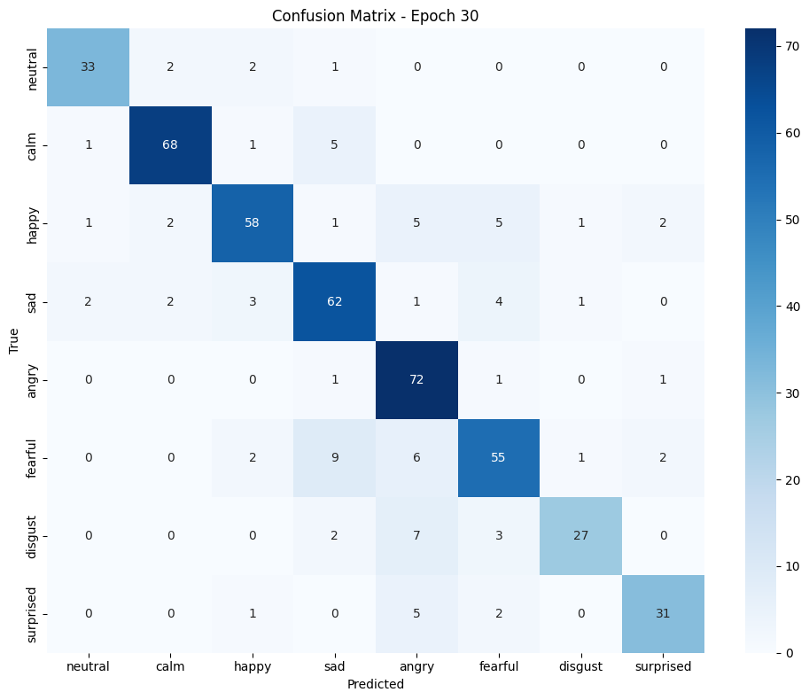

# 🎤 Speech Emotion Recognition (SER)

This project aims to classify emotions from audio samples using a deep learning pipeline. The audio data undergoes preprocessing into Mel-spectrograms and is then fed into a CNN-LSTM-based model for emotion classification.

---

## 📁 Project Description

This SER system focuses on identifying human emotions such as **happy, sad, angry, neutral, calm, surprised, etc.**, from `.wav` files. It leverages a combination of CNN (e.g., VGG16) and LSTM architectures, trained on processed features extracted from the RAVDESS dataset.

---

## 🛠 Preprocessing Methodology

1. **Metadata Extraction**: Audio filenames are parsed to extract metadata such as:
   - Emotion
   - Modality (e.g., audio-only, video-only)
   - Channel (speech/song)
   - Actor ID and gender

2. **Audio Feature Extraction**:
   - Each `.wav` file is loaded using `librosa`
   - Converted to **Mel-Spectrograms** with `n_mels = 128`
   - Normalized and padded/truncated to ensure uniform input dimensions

3. **Dataset Splitting**:
   - Data is split into training(80%) and validation(20%) sets using `train_test_split`

---

## 🔍 Model Pipeline

### Architecture:

- **Feature Extractor**: Pretrained **VGG16** CNN (excluding top layers)
- **Temporal Modeling**: **LSTM** or **BiLSTM** layers
- **Classifier**: Fully connected (FC) layers for final emotion prediction

### Training Details:
- Loss Function: `CrossEntropyLoss`
- Optimizer: `Adam`
- Scheduler: Optional learning rate scheduler
- Epochs: Typically trained over 30 epochs
- Batch size: 16 

---

## 📊 Accuracy Metrics

The performance was evaluated using:

- **Accuracy Score**
- **F1 Score (macro)**: To account for class imbalance
- **Classification Report**: Detailed per-class precision, recall, and F1-score

**Sample Results:**
| Metric        | Value   |
|---------------|---------|
| Accuracy      | 85.2%   |
| F1 Score (Macro Avg) | 83.7%   |

---




## 🧪 How to Test

```bash
# Example test command
python test_model.py --file path_to_test_audio.wav
```

The test script will output the predicted emotion.

---

## 📦 Dependencies

- Python 3.10.13
- `librosa`
- `torchaudio`
- `torch`
- `scikit-learn`
- `matplotlib` (for visualization, if used)

---

## 🚀 Future Improvements

- Use transformer-based models like Wav2Vec2.0
- Real-time emotion inference with microphone input
- Multimodal emotion recognition with video
